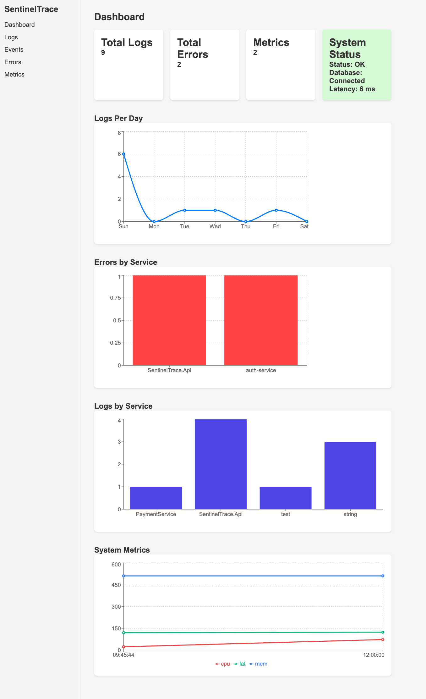
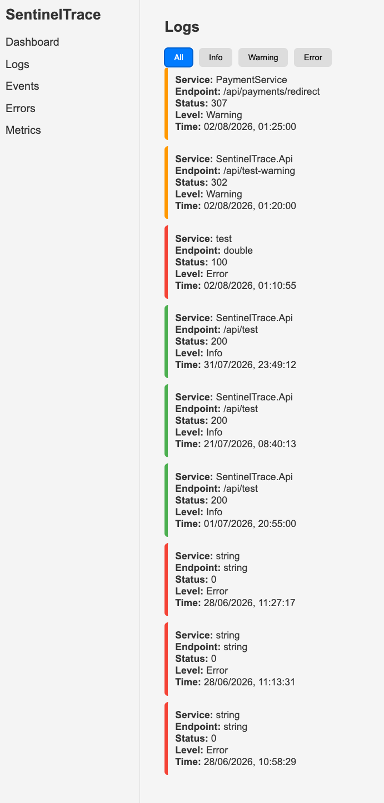
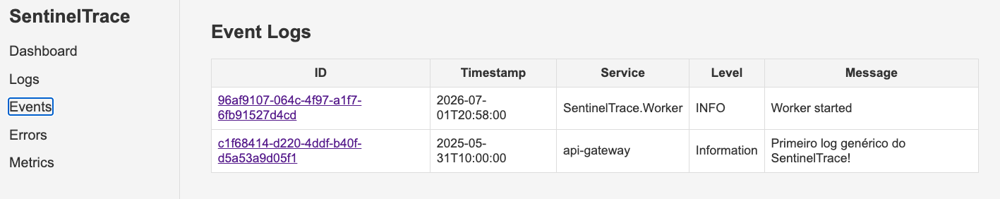
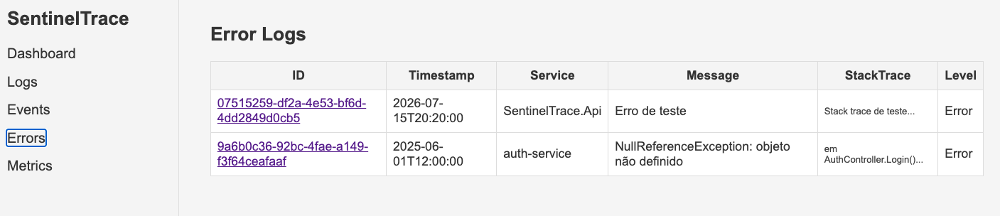
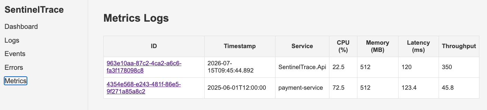

📘 SentinelTrace — Observability & Monitoring Platform
A complete monitoring, metrics, logging, health check, and real‑time dashboard system inspired by enterprise‑grade tools such as Datadog, Grafana, New Relic, and Elastic APM.

Built with:

- ASP.NET Core 8 (Minimal APIs)
- Domain‑Driven Design (DDD)
- Clean Architecture
- React + Vite
- EF Core + SQLite
- Worker Service
- Real‑time dashboard

---
🎯 Project Purpose

SentinelTrace was built to demonstrate strong engineering capabilities in:

Professional architecture (DDD + Clean Architecture)

Observability and monitoring

Structured logging

Performance metrics

Real health check (API + Database + Latency)

Interactive dashboard consuming real backend data

Frontend + backend integration

Modern engineering best practices

This project was designed to stand out to recruiters on platforms like LinkedIn, Seek, and Indeed by showcasing the ability to build real systems, not just CRUD applications.

---
🏛️ Architecture (DDD + Clean Architecture)

The solution follows Domain‑Driven Design principles, clearly separating:

✔ Domain — entities and business rules
✔ Application — use cases, DTOs, services
✔ Infrastructure — database, repositories, EF Core
✔ API — minimal endpoints
✔ Worker — background processing
✔ Dashboard — monitoring interface

This structure ensures:

✔ scalability

✔ testability

✔ low coupling

✔ high cohesion

✔ maintainability

---
📊 Observability (Datadog‑Style)

The dashboard provides:

✔ Real‑time health check
✔ Database connectivity status
✔ API latency
✔ Log filtering by level (Info, Warning, Error)
✔ Request metrics
✔ Structured events and errors

All inspired by platforms like Datadog, Grafana, and Kibana.

---
❤️ Advanced Health Check

The /api/health endpoint returns:

json
{
  "status": "OK",
  "database": "Connected",
  "latencyMs": 6,
  "timestamp": "2026-08-01T00:34:25Z"
}
It measures:

API availability

Database connectivity

Real request latency

The dashboard displays:

🟢 OK
🔴 Offline / Error

---
📝 Structured Logs

The Logs page displays:

Service

Endpoint

StatusCode

Level (Info, Warning, Error)

Timestamp

CorrelationId

With filters:

All

Info

Warning

Error

Log levels are automatically determined:

✔ 200–299 → Info
✔ 300–399 → Warning
✔ 400+ or invalid → Error

---
⚙️ Worker Service:

The Worker handles asynchronous tasks such as:

metrics ingestion

event processing

simulation of real pipelines

---
🖥️ Dashboard (React + Vite):

The dashboard displays:

✔ System status
✔ Latency
✔ Database status
✔ Filtered logs
✔ Metrics
✔ Events

With a modern, responsive UI and dynamic color feedback.

---
📡 Main Endpoints
Health  
GET /api/health

Logs  
GET /api/logs

Metrics  
GET /api/metrics

Events  
GET /api/events

Errors  
GET /api/errors

---
🧪 Technologies Used:

✔ ASP.NET Core 8
✔ EF Core
✔ SQLite
✔ React + Vite
✔ TypeScript
✔ Worker Service
✔ Clean Architecture
✔ DDD
✔ Fetch API
✔ CORS
✔ Swagger

---
🚀 How to Run
Backend
bash
dotnet restore
dotnet build
dotnet run
Frontend
bash
npm install
npm run dev

---
📌 Current Status
✔ Health check fully functional
✔ Dynamic dashboard
✔ Log filtering
✔ Real latency measurement
✔ Database status
✔ Worker running
✔ Clean architecture
✔ Ready for LinkedIn / GitHub / Seek / Indeed

---
🎉 Conclusion
SentinelTrace demonstrates:

✔ strong architectural skills

✔ solid observability knowledge

✔ backend expertise (.NET)

✔ frontend integration (React)

✔ ability to build real‑world systems

✔ above‑average engineering maturity

---
📸 Screenshots

### 🟢 Dashboard Overview

### 📊 Logs Page

### 🎯 Events Page

### ❌ Errors Page

### 📈 Metrics Page
